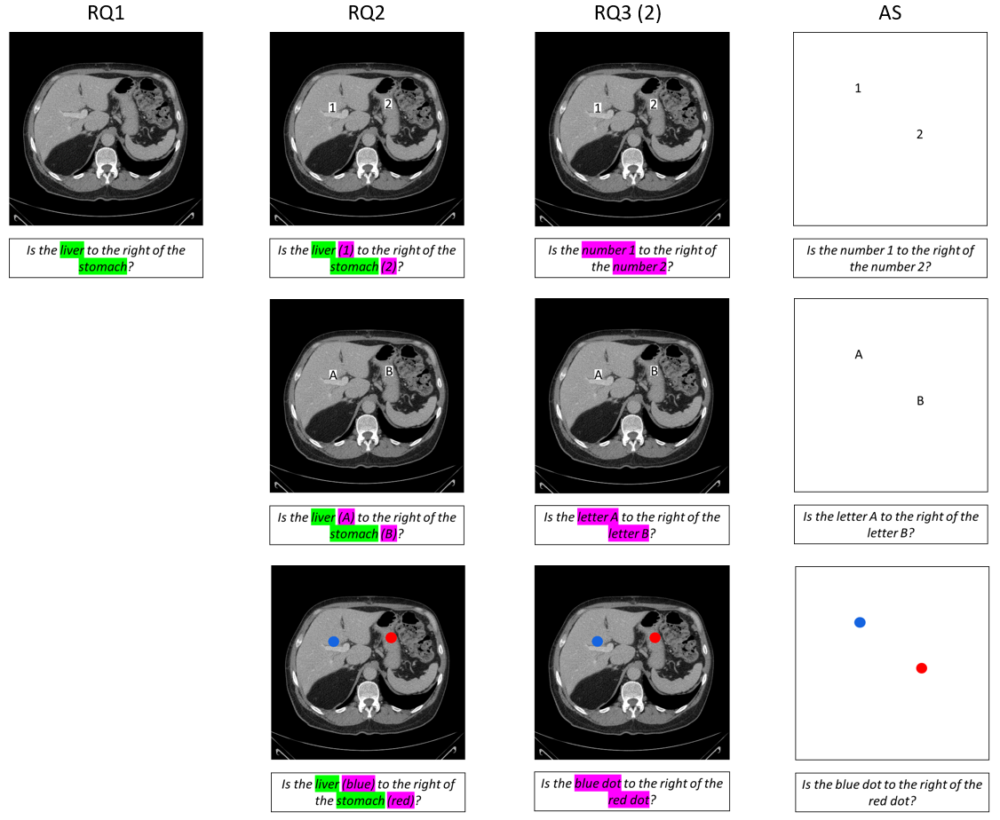

# **Download the Dataset**

You can download the full MIRP Benchmark dataset in two ways:  

-  **Hugging Face**: [MIRP_Hugging_Face](https://huggingface.co/datasets/Wolfda95/MIRP_Your_Other_Left/tree/main)  
-  **Google Drive**: [MIRP_Google_Drive](https://drive.google.com/file/d/1ILjP6koHgHI7pkXcoce70nNncyz-48KM/view)  

Both options provide a `.zip` file (6.6GB) containing the datasets for all Research Questions (RQ1, RQ2, RQ3) and the Ablation Study (AS). 

<br/>

### **Preview Before Downloading**
If you would like to see what the dataset looks like before downloading it:  <br>
This folder structure here mirrors the structure of the full dataset but contains **only 10 example cases** for each setup.  

<br/>

### ⏭️ **Next Step**
After downloading and extracting the dataset, please:
1. Familiarize yourself with the structure (see below).  
2. Continue to the [`2_inference_code/`](https://github.com/Wolfda95/MIRP_Benchmark/tree/main/2_inference_code) folder to run inference.
 

<br/> <br/>

---
# Information about the Dataset: 

Each subfolder for the **Research Questions (RQ1, RQ2, RQ3)** and the **Ablation Study (AS)** contains:  
- **Image folders** with the rotated/flipped CT slices  
- **JSON files** with corresponding question-answer (QA) pairs for each CT slice

<br/>

## Example for each Research Question: 

For details, check the paper summary on our [Project Page](https://wolfda95.github.io/your_other_left/).

<br/>

## Folder Structure of the MIRP Dataset: 

#### 📁 **RQ1 (Research Question 1)**  
- `images/` – CT slices  
- `qa.json` – Question-answer pairs

#### 📁 **RQ2 (Research Question 2)**  
- `image_dots/` – CT slices with dot markers  
- `image_letters/` – CT slices with letter markers  
- `image_numbers/` – CT slices with number markers  
- `qa_dots.json` – QA pairs with anatomical names for dot markers
- `qa_letters.json` – QA pairs with anatomical names for letter markers  
- `qa_numbers.json` – QA pairs with anatomical names for number markers  

#### 📁 **RQ3 (Research Question 3(2))**  
- `image_dots/` – CT slices with dot markers  
- `image_letters/` – CT slices with letter markers  
- `image_numbers/` – CT slices with number markers  
- `qa_dots.json` – QA pairs without anatomical names for dot markers 
- `qa_letters.json` – QA pairs without anatomical names for letter markers  
- `qa_numbers.json` – QA pairs without anatomical names for number markers  

#### 📁 **AS (Ablation Study)**  
- `image_dots/` – White images with dot markers  
- `image_letters/` – White images with letter markers  
- `image_numbers/` – White images with number markers  
- `qa_dots.json` – QA pairs for dot markers 
- `qa_letters.json` – QA pairs for letter markers  
- `qa_numbers.json` – QA pairs for number markers

<br/>

**Note:**  
- **RQ3** is the dataset we used for **RQ3(2)**.  
- For **RQ3(1)**, we use the **same data as RQ1** — only the evaluation method later differs (answers are later checked for standard anatomy correctness instead of image orientation correctness). 
- Need a refresher on the research questions? Check the paper summary on our [Project Page](https://wolfda95.github.io/your_other_left/).

<br/>

## Anatomic Structures that we use in MIRP: 
We extracted the anatomical structures that the questions refer to using the Totalsegmentatior: https://github.com/wasserth/TotalSegmentator

The correct answers to the relative positioning questions are obtained by comparing the centers of mass of the two structures being evaluated. 

<details>
<summary><h3>List of all the Anatomical Structures</h3></summary>

Here is the list of all the structures (we have grouped the different vertebrae and ribs together): 

  |Index|TotalSegmentator name
  |:-----|:-----|
  1 | spleen |
  2 | kidney_right |
  3 | kidney_left |
  4 | gallbladder |
  5 | liver |
  6 | stomach |
  7 | pancreas |
  8 | adrenal_gland_right | 
  9 | adrenal_gland_left | 
  10 | lung_upper_lobe_left | 
  11 | lung_lower_lobe_left | 
  12 | lung_upper_lobe_right |
  13 | lung_middle_lobe_right | 
  14 | lung_lower_lobe_right | 
  15 | esophagus |
  16 | trachea |
  17 | thyroid_gland |
  18 | small_bowel | 
  19 | duodenum |
  20 | colon |
  21 | urinary_bladder |
  22 | prostate |
  23 | kidney_cyst_left |
  24 | kidney_cyst_right |
  25 | sacrum |
  26 | vertebrae |
  51 | heart |
  52 | aorta |
  53 | pulmonary_vein |
  54 | brachiocephalic_trunk |
  55 | subclavian_artery_right |
  56 | subclavian_artery_left |
  57 | common_carotid_artery_right |
  58 | common_carotid_artery_left |
  59 | brachiocephalic_vein_left |
  60 | brachiocephalic_vein_right |
  61 | atrial_appendage_left |
  62 | superior_vena_cava |
  63 | inferior_vena_cava |
  64 | portal_vein_and_splenic_vein |
  65 | iliac_artery_left |
  66 | iliac_artery_right |
  67 | iliac_vena_left |
  68 | iliac_vena_right |
  69 | humerus_left |
  70 | humerus_right |
  71 | scapula_left |
  72 | scapula_right |
  73 | clavicula_left |
  74 | clavicula_right | 
  75 | femur_left |
  76 | femur_right |
  77 | hip_left |
  78 | hip_right |
  79 | spinal_cord |
  80 | gluteus_maximus_left |
  81 | gluteus_maximus_right | 
  82 | gluteus_medius_left | 
  83 | gluteus_medius_right |
  84 | gluteus_minimus_left | 
  85 | gluteus_minimus_right | 
  86 | autochthon_left |
  87 | autochthon_right |
  88 | iliopsoas_left |
  89 | iliopsoas_right | 
  90 | brain |
  91 | skull |
  92 | rib_left |
  93 | rib_right |
  116 | sternum |
  117 | costal_cartilages |
  
</details>

<br/>

## Details on the Question-Answer JSON Files
This is one exmaple element of a question answer json file. 
  ```
  {
    "filename": "amos_0002.nii_slice-20_classes-22_perc-12.png",
    "base_name": "amos_0002.nii",
    "slice_index": 20,
    "classes_count": 22,
    "multiple_components_same_label": true,
    "question_answer": [
      {
        "object1_name": "left kidney",
        "object2_name": "inferior vena cava",
        "object1_gray": 3,
        "object2_gray": 63,
        "object1_center_x": 346.97574777687953,
        "object1_center_y": 214.49151172190784,
        "object2_center_x": 231.29456193353474,
        "object2_center_y": 290.3836858006042,
        "question": "Is the left kidney below the inferior vena cava?",
        "answer": 0
      }
    ],
    "rotate_flip_short": "A3",
    "rotate_flip_long": "Horizontal flip and 180 degree rotation"
  },
```
- `filename`: Filename of the PNG image to match the question to the image
- `base_name`: The original CT volume where the slice was extraced from (Either a volume from the [Amos](https://zenodo.org/records/7155725) dataset or from the [BTCV](https://zenodo.org/records/1169361) dataset)
- `slice_index`: Slice number within the CT volume.
- `classes_count`: Number of anatomical structures segmented by TotalSegmentator that are visible in the slice.
- `multiple_components_same_label`: Whether there are multiple disconnected components of the same anatomical structure in the slice. (We only asked questions about structures that appear once per slice.)
- `question_answer`
  - `object_name`: Anatomical names of the structures.
  - `object_gray`: Label index from the TotalSegmentator table (used for number markers; letter markers start at AA for 1 and continue with AB, AC, …).
  - `object_center`: x and y coordinates of the center of mass of the two structures the correct answers to the questions were derived from these centers).
  - `question`: The question presented to the model.
  - `answer`: The correct answer (0 = no, 1 = yes).
- `rotate_flip_short`: Information on how the image is roated and flipped (A: Flip: A1 0°, A2: 90°, A3: 180°, A4 270° || B: Not Flipped: B1 0°, B2: 90°, B3: 180°, B4 270°)

----

# Fixed Prompt: 
The json files contain the questions that we pass to the model. 

In addition to the question, we add a fixed text prompt: 

#### RQ1, RQ2, RQ3: 
```
"The image is a 2D axial slice of an abdominal CT scan with soft tissue windowing. "
"Answer strictly with '1' for Yes or '0' for No. No explanations, no additional text. "
"Your output must contain exactly one character: '1' or '0'."
"Ignore anatomical correctness; focus solely on what the image shows.\n"
"Example:\n"
"Q: "Is the aorta above the spleen?" A: 1\n"
"Now answer the real question:\n\n"
f"Q: {question_from_json}"
```
#### AS: 
```
"Answer strictly with '1' for Yes or '0' for No. No explanations, no additional text. "
"Your output must contain exactly one character: '1' or '0'."
"Focus solely on what the image shows.\n"
"Example:\n"
"Q: "Is the red dot above the blue dot" A: 1\n"
"Now answer the real question:\n\n"
f"Q: {question_from_json}"
```
The example questions in the fixed prompt are chosen to match the question in the task. <br> 
For example, RQ2 with dot marks: <em>"Is the aorta (red) above the spleen (blue)?</em>  

The [`2_inference_code/`](2_inference_code) already contains those fixed prompts.


  
