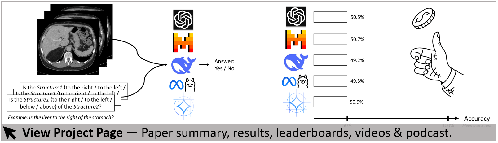

<div align="center"> 
<h1>Your <i>other</i> Left! <br> Vision-Language Models Fail <br> to Identify Relative Positions in Medical Images</h1>

  <div class="is-size-5">
    MICCAI 2025
  </div>

  <br>
   
  <p style="font-size: 20px;">
      <span class="author-block">
        <a href="https://viscom.uni-ulm.de/members/daniel-wolf/">Daniel Wolf</a><sup>1,2</sup>,</span>
      <span class="author-block">
        <a href="https://www.linkedin.com/in/heiko-hillenhagen/?originalSubdomain=de/">Heiko Hillenhagen</a><sup>2</sup>,</span>
      <span class="author-block">
        <a href="https://www.uniklinik-ulm.de/radiologie-diagnostische-und-interventionelle/team.html">Billurvan Taskin</a><sup>2</sup>,</span>
      <span class="author-block">
        <a href="https://a13x.io/">Alex Bäuerle</a><sup>3</sup>,</span>
      <span class="author-block">
        <a href="https://www.uniklinik-ulm.de/radiologie-diagnostische-und-interventionelle/team/prof-dr-m-beer.html">Meinrad Beer</a><sup>2</sup>,</span>
      <span class="author-block">
        <a href="https://www.uniklinik-ulm.de/radiologie-diagnostische-und-interventionelle/schwerpunkte-sektionen/sektion-experimentelle-radiologie.html">Michael Götz</a><sup>2,*</sup>,</span>
      <span class="author-block">
        <a href="https://viscom.uni-ulm.de/members/timo-ropinski/">Timo Ropinski</a><sup>1,*</sup>
      </span>
  </p>
  <p>
      <em>* Shared Last Authorship</em>
  </p>
  <p>
    <span class="author-block">
      <sup>1</sup><a href="https://viscom.uni-ulm.de/">Visual Computing Group, Ulm University</a>,</span>
    <span class="author-block">
      <sup>2</sup><a href="https://www.uniklinik-ulm.de/en/radiology-diagnostic-and-interventional-radiology.html">Clinic for Radiology, Ulm University Medical Center</a>,</span>
    <span class="author-block">
      <sup>3</sup><a href="https://axi.om/">Axiom Bio</a>
    </span>
  </p>

  <br>

[](https://wolfda95.github.io/your_other_left/)
[](https://arxiv.org/abs/2508.00549)
[](LICENSE)

</div>

---
# How to use the MIRP Benchmark Dataset and Code: 

### 1. Download the Dataset 🗂️  
Go to [`1_dataset_guide/`](1_dataset_guide): Instructions on how to download the MIRP Benchmark dataset and details on its structure.    

### 2. Run Inference on the Vision-Language Models 🚀 
Go to [`2_inference_code/`](2_inference_code): Scripts for running inference on Vision-Language Models (GPT-4o, Pixtral, Llama3.2, JanusPro).  

### 3. Evaluate the Answers of the Vision-Language Models 📊   
Go to [`3_evaluation_code/`](3_evaluation_code): Scripts for evaluating model outputs and computing statistics.

### Our Results
Go to [`our_results/`](our_results): Our precomputed results for comparison. 

<br/>

Each subdirectory includes a **`README.md`** with further details.  

---
# For Details about the Paper, Visit our Project Page: 

[](https://wolfda95.github.io/your_other_left/)


---
# Cite: 
```latex
@inproceedings{wolf2025medvlms,
  title={Your other Left! Vision-Language Models Fail to Identify Relative Positions in Medical Images},
  author={Wolf, Daniel and Hillenhagen, Heiko and Taskin, Billurvan and B{\"a}uerle, Alex and Beer, Meinrad and G{\"o}tz, Michael and Ropinski, Timo},
  booktitle={International Conference on Medical Image Computing and Computer-Assisted Intervention -- MICCAI},
  year={2025},
  organization={Springer Nature Switzerland}
  doi={tba}
}
```
If you have any questions, please email me:
[daniel.wolf@uni-ulm.de](mailto:daniel.wolf@uni-ulm.de)
